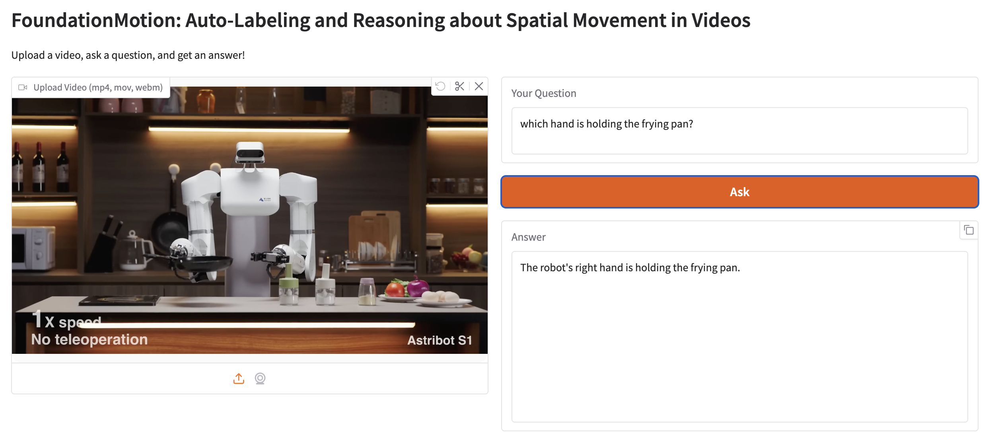

# FoundationMotion

[Paper](https://arxiv.org/pdf/2512.10927) | [Project Page](https://yulugan.com/projects/FoundationMotion.html) | [Model](https://huggingface.co/WoWolf/models) | [Datasets](https://huggingface.co/datasets/WoWolf/v2-dev/tree/main) | [Interactive Demo](https://huggingface.co/spaces/yulu2/FoundationMotion) | [Citation](#citation)

FoundationMotion offers a scalable way to curate detailed motion datasets, enabling effective fine-tuning of diverse models (VLM / VLA / World Models) to improve motion and spatial reasoning. 


## Environment Setup

If you want to construct datasets using our dataset curation pipeline: see installation instructions in [data_pipeline/README.md](data_pipeline/README.md)

If you want to use our finetuned model:

```bash
pip install fire tqdm huggingface-hub
pip install -U https://github.com/NVlabs/VILA
```

## Usage

### Data curation

Follow the instructions in [data_pipeline/README.md](data_pipeline/README.md) to set up the video files you want to process. Customize your paths and settings in `data_pipeline/scripts/config.sh`.

Run:
```bash
bash data_pipeline/scripts/submit_ranges.sh
```

This will start processing video data. Modify `submit_range 0 60` to specify the range of videos to process — 0 is the starting index and 60 is the ending index. You can submit multiple jobs with different or even overlapping ranges; we handled all the rest for you. Just submit your jobs and adjust the start/end values as needed.

### Eval

```bash
python eval/vila_motionbench.py \
    --task="robotics_hand_eval" \
    --base_dir="~/workspace/v2-dev" \
    --model_path="WoWolf/nvila_15b_video-fm-tuned"
```


## Interactive Demo

Full Huggingface Demo (this demo is also hosted on [Huggingface Spaces](https://huggingface.co/spaces/yulu2/FoundationMotion))



Run the demo:
```bash
python app.py
```

Drag a video, ask a question, and get an ansewer.

## Examples

### [Data Curation] Process a single video
- [data_pipeline/process_single_video.py](data_pipeline/process_single_video.py) - script to process a single video to get trajectories, captions, and question–answer pairs.

```bash
python process_single_video.py --video_path /path/to/video.mp4 --base_output_dir /path/to/output
```

### [Model Inference] Process a single video
- [examples/demo_nvila.py](data_pipeline/demo_nvila.py) - script to process a single video using our model.

```bash
python demo_nvila.py --video_path /path/to/video.mp4 --prompt "Your question here"
```


## Citation
If you use our work or our implementation in this repo, or find them helpful, please consider giving a citation in the following format.

```bash
@misc{gan2025foundationmotion,
    title={FoundationMotion: Auto-Labeling and Reasoning about Spatial Movement in Videos}, 
    author={Yulu Gan and Ligeng Zhu and Dandan Shan and Baifeng Shi and Hongxu Yin and Boris Ivanovic and Song Han and Trevor Darrell and Jitendra Malik and Marco Pavone and Boyi Li},
    year={2025},
    eprint={2512.10927},
    archivePrefix={arXiv},
    primaryClass={cs.CV},
    url={https://arxiv.org/abs/2512.10927}, 
}
```


#### FoundationMotion is also referred to as Wolf V2 🐺, the second chapter in the Wolf series: https://wolfv0.github.io/.
